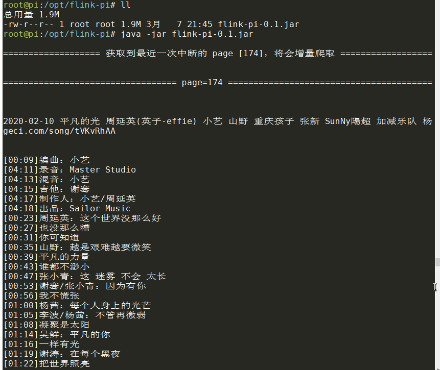
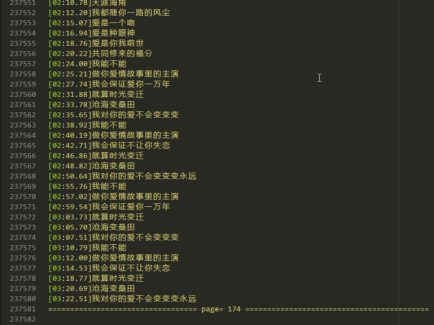
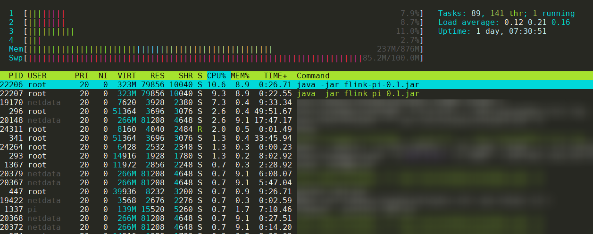

# flink-pi
# 树莓派不吃灰，跑个flink 实时分析任务不香吗？

单独打包运行，不依赖部署flink 环境：  


```xml
<plugin>
    <groupId>org.apache.maven.plugins</groupId>
    <artifactId>maven-shade-plugin</artifactId>
    <version>3.1.0</version>
    <configuration>
        <createDependencyReducedPom>false</createDependencyReducedPom>
    </configuration>
    <executions>
        <execution>
            <phase>package</phase>
            <goals>
                <goal>shade</goal>
            </goals>
            <configuration>
                <transformers>
                    <transformer implementation="org.apache.maven.plugins.shade.resource.ManifestResourceTransformer">
                        <!-- 主类 -->
                        <mainClass>cn.java.FlinkPi.source.KugeciHttp</mainClass>
                    </transformer>
                    <transformer implementation="org.apache.maven.plugins.shade.resource.AppendingTransformer">
                        <resource>reference.conf</resource>
                    </transformer>
                </transformers>
                <filters>
                    <filter>
                        <!--不要拷贝 META-INF 目录下的签名，否则会引起 SecurityExceptions 。 -->
                        <artifact>*:*:*:*</artifact>
                        <excludes>
                            <exclude>META-INF/*.SF</exclude>
                            <exclude>META-INF/*.DSA</exclude>
                            <exclude>META-INF/*.RSA</exclude>
                        </excludes>
                    </filter>
                </filters>
            
            </configuration>
        </execution>
    </executions>
</plugin>
```

数据保存格式  


运行监控：  


2020-03-07:  
优化打包容量，压缩为1.9MB，减轻树莓派压力！！！ 
