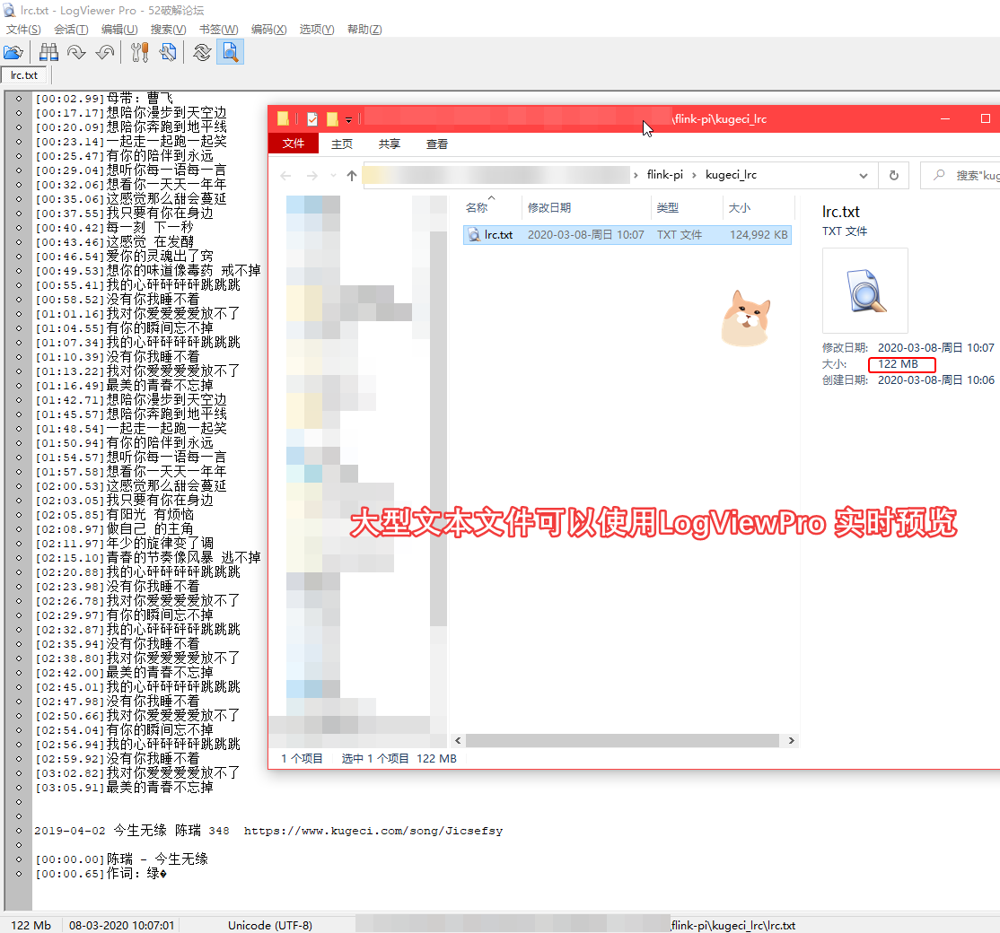

树莓派不吃灰，跑个flink 实时分析任务不香吗？

项目宗旨：  
尽可能以最低成本实现 flink +树莓派最大化的利用，让树莓派不再吃灰  😜❤

快速开始：  
```bash
cd flink-pi
maven clean package
ls target/
...
> flink-pi-0.1.jar
...
nohup java -jar flink-pi-0.1.jar & 
tail -f /tmp/lrc.txt
...
```

树莓派型号：3B+，之前在树莓派部署了单机版的 flink 环境，上传了一个简单的 wordcount 工程，但是每次跑了两个小时就出现 taskmanager 和 jobmanager 断联故障，而且整个机器资源非常紧张，于是放弃了这个方案，改为单独部署 jar 包，扔掉 flink 部署环境以实现轻量化。   

pom.xml 核心配置：  
```xml
<plugin>
    <groupId>org.apache.maven.plugins</groupId>
    <artifactId>maven-shade-plugin</artifactId>
    <version>3.1.0</version>
    <configuration>
        <createDependencyReducedPom>false</createDependencyReducedPom>
    </configuration>
    <executions>
        <execution>
            <phase>package</phase>
            <goals>
                <goal>shade</goal>
            </goals>
            <configuration>
                <transformers>
                    <transformer implementation="org.apache.maven.plugins.shade.resource.ManifestResourceTransformer">
                        <!-- 主类 -->
                        <mainClass>cn.java666.FlinkPi.source.KugeciHttp</mainClass>
                    </transformer>
                    <transformer implementation="org.apache.maven.plugins.shade.resource.AppendingTransformer">
                        <resource>reference.conf</resource>
                    </transformer>
                </transformers>
                <filters>
                    <filter>
                        <!--不要拷贝 META-INF 目录下的签名，否则会引起 SecurityExceptions 。 -->
                        <artifact>*:*:*:*</artifact>
                        <excludes>
                            <exclude>META-INF/*.SF</exclude>
                            <exclude>META-INF/*.DSA</exclude>
                            <exclude>META-INF/*.RSA</exclude>
                        </excludes>
                    </filter>
                </filters>
            
            </configuration>
        </execution>
    </executions>
</plugin>
```

中断后支持增量爬取：  


爬取到的歌词格式暂未做 ETL：    


运行监控，树莓派完全无压力：  


大型文本文件可以使用 LogViewPro 实时预览：


2020-03-07:  
- 目前只用到爬取数据源所需的依赖，尽可能屏蔽用不到的依赖，优化打包容量，压缩为1.9MB，减轻树莓派压力； 
- 开发增量爬取，记录断点，重启后可以记住上次爬取位置；

2020-03-08：
- 修正部分错误，完善文档
- 抽样部分爬取数据

- 截至目前，已爬取 8万首歌词入库到 elasticsearch，下一步还在规划继续开发的方向。


